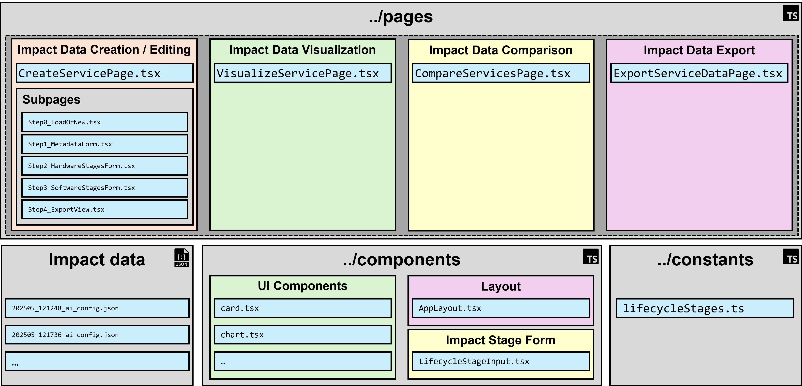

# CGASSEF: AI Sustainability Assessment Tool

[](https://reactjs.org/)
[](https://www.typescriptlang.org/)
[](https://vitejs.dev/)
[](https://opensource.org/licenses/MIT)

---

<p align="center">
  
</p>

## About The Project

This repository contains the source code for the **Comprehensive (Generative) AI Service Sustainability Assessment Framework (CGASSEF)** web prototype. 

The tool is a concrete implementation of the "Tool Approach" derived from the Design Science Research Process (DSRP) methodology by Peffers et al. (2007). It translates the conceptual CGASSEF framework into a concreate web tool for managing, assessing, and visualizing the environmental sustainability impact of AI services within an organizational context.

## The Core Data Model

The entire prototype is built around a central, well-defined data structure represented in JSON format. This `AIServiceLifecycleImpact` object serves as the single source of truth for an AI service's impact profile.

-   **Metadata:** Includes a unique `serviceId`, a human-readable `name`, and a `description`.
-   **`cycleStages` Object:** This is the core of the data model. It's a key-value map containing an entry for every phase of the AI service's software and hardware lifecycle (e.g., `modelTraining`, `hardwareManufacturing`).
-   **`impactCalculationMode`:** Each lifecycle stage has a mode to define how its impact is specified:
    -   `none`: The impact for this stage is not specified or is considered zero.
    -   `approximation`: The impact is a manually entered, estimated CO₂ value (`co2EqInKg`).
    -   `dynamic`: A placeholder for future integration with a live data API, defined by an `httpApiUrl`.

## Core Functions

The prototype is structured around four primary functions, accessible via a tab-based navigation system:

### 1. Create / Edit AI Service Impacts (`/create`)
A multi-step wizard guides users through creating a new AI service impact profile from scratch or uploading an existing JSON file to edit. Users define service metadata, opt in or out of hardware lifecycle stages, and configure the impact for each software and hardware phase using the different calculation modes. The final result is a downloadable, well-structured JSON file conforming to the core data model.

### 2. Visualize AI Service Impact (`/visualize`)
Upload a service's JSON file to generate an interactive dashboard. This page displays the total estimated CO₂ emissions and features several charts from the **Recharts** library:
-   A pie chart breaking down the total impact by each lifecycle stage.
-   A pie chart comparing the sum of **Operational Emissions** (software) vs. **Embodied Emissions** (hardware).
-   A bar chart showing the absolute CO₂ value for each stage.

### 3. Compare AI Services (`/compare`)
Upload two or more AI service JSON files for a side-by-side comparison. Users can configure parameters, such as the total number of **inference requests**, to calculate relative metrics. This generates a **Radar Chart** that provides a normalized (0-100%) comparison of the services across key sustainability dimensions (e.g., *Avg. CO₂ per Inference*, *Total Embodied Impact*). A larger area on the chart indicates a relatively higher impact, allowing for quick visual analysis.

### 4. Export Impact Data (`/export`)
Provides a bridge to external tools by converting the hierarchical JSON data into a flat, tabular **CSV file**. Each row in the CSV represents a single lifecycle stage of the AI service, making the data easy to import into spreadsheet programs or BI solutions for further reporting and analysis. This functionality uses the **Papaparse** library for robust client-side CSV generation.

## Tech Stack

This prototype is built with a modern web technology stack:

-   **Framework:** [React](https://reactjs.org/)
-   **Language:** [TypeScript](https://www.typescriptlang.org/)
-   **Build Tool:** [Vite](https://vitejs.dev/)
-   **UI Components:** [shadcn/ui](https://ui.shadcn.com/) 
-   **Styling:** [Tailwind CSS](https://tailwindcss.com/)
-   **Data Visualization:** [Recharts](https://recharts.org/)
-   **CSV Generation:** [Papaparse](https://www.papaparse.com/)
-   **Routing:** [React Router](https://reactrouter.com/)

## Project Structure

The codebase is organized via the following directory structure:

<p align="center">
  
</p>

## Setup and Running Locally

To get a local copy up and running, follow these simple steps.

1.  **Clone the repository:**
    ```sh
    git clone <repository-url>
    ```
2.  **Navigate to the project directory:**
    ```sh
    cd <project-directory>
    ```
3.  **Install NPM packages:**
    ```sh
    npm install
    ```
4.  **Run the development server:**
    ```sh
    npm run dev
    ```
5.  Open your browser to `http://localhost:5173` (or the address provided by Vite).